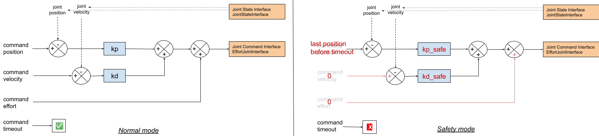

joint_group_ff_controllers
===

# Overview

This package implements basic controllers (similarly to [ros_controllers](https://github.com/ros-controls/ros_controllers)).

## License

The source code is released under a [MIT license](./LICENSE).

**Author/Maintener: EtienneAr<br />
Affiliation: INRIA Paris**

This package package has been tested under [ROS] Melodic on respectively Ubuntu 18.04.
This is research code, expect that it changes often and any fitness for a particular purpose is disclaimed.

# Installation

## Building from Source

To build from source, clone the latest version from this repository into your catkin workspace and compile the package using

	cd catkin_workspace/src
	git clone https://github.com/inria-paris-robotic-lab/joint_group_ff_controllers.git
	cd ../
	rosdep install --from-paths . --ignore-src
	catkin build

# Controllers

## Effort controller : joint_group_effort_ff_controller

This controller tracks position, velocity and effort commands for a set of joints using a pid-feedforward controller. It expects a EffortJointInterface type of hardware interface. The control is done as followed, for each joint : <br/>



### Subscribed Topics

* **`command`** ([joint_group_ff_controllers/effort_command])

	The positions, velocities and efforts set point for each joint, aswell as the timeout value.  
	*Note: if `timeout < 0`, then the timeout is ignored and the command will be executed indefinitely.*

### Parameters

* **`joints`** (string[])

	The list of joints to control.

* **`<joint>`** (associative array)

	Key/Value pairs for the controller gains. Expected keys are `kp`, `kd`, `kp_safe`, `kd_safe`.

> Controller configuration example
> ```
> arm_right_controller_test:
>   type: joint_group_ff_controllers/JointGroupEffortFFController
>   joints:
>   - arm_right_1_joint
>   - arm_right_2_joint
>   - arm_right_3_joint
>   - arm_right_4_joint
>   - arm_right_5_joint
>   - arm_right_6_joint
>   - arm_right_7_joint
>   arm_right_1_joint: { kp: .01, kd: .01, kp_safe: 1000, kd_safe: 64. }
>   arm_right_2_joint: { kp: .01, kd: .01, kp_safe: 1000, kd_safe: 64. }
>   arm_right_3_joint: { kp: .01, kd: .01, kp_safe: 1000, kd_safe: 64. }
>   arm_right_4_joint: { kp: .01, kd: .01, kp_safe: 1000, kd_safe: 64. }
>   arm_right_5_joint: { kp: .01, kd: .01, kp_safe: 1000, kd_safe: 64. }
>   arm_right_6_joint: { kp: .01, kd: .01, kp_safe: 1000, kd_safe: 64. }
>   arm_right_7_joint: { kp: .01, kd: .01, kp_safe: 1000, kd_safe: 64. }
> ```
> *Note :* Usually kp and kd are set to small values as the effort feed-forward should do most of the "work". kp_safe and kd_safe on the other hand are buigger as they should be able to keep the robot stable in it's current position (without any feed-forward), in case of timeout.